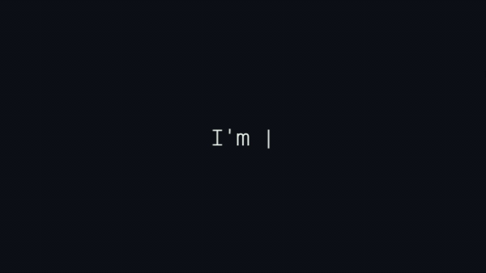

<h1 align="center">Auto Writing Text Effect</h1>

<p align="center">
  
  
</p>

O projeto foi desenvolvido para fins acadêmicos e também para solucionar minha curiosidade sobre como funciona o efeito "Auto Writing Text".
<br>
Gif mostrando o efeito:

<p align="center">
    
</p>

## Clonando o repositório
```sh
git clone https://github.com/LuscaMD/AutoTextWriting
```
